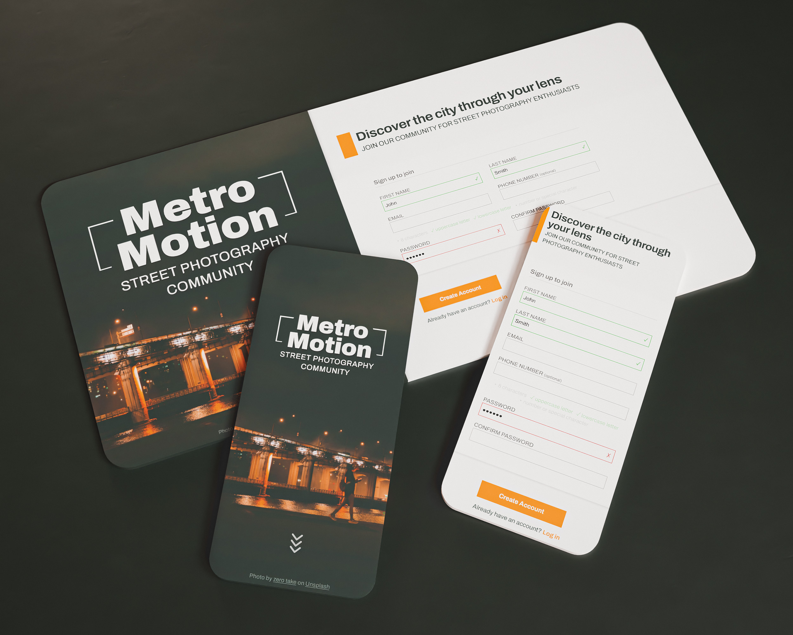

## Project

**Sign-up form** for an imaginary website 'Metro Motion'
[View Demo](https://pascard20.github.io/metro-motion-signup-form/)

  

 

## Built with

- **HTML**
- **CSS**
- **JavaScript**

 

## Features

- **Fully responsive design** optimized for both mobile and desktop.
- **Attention to UX**, with an intuitive and elegant interface for a user-friendly sign-up process.
- **Input validation** to enforce data accuracy and integrity, reducing the possibility of errors during submission.
- **Password requirements with visual indicators**, aiding users in creating strong and secure passwords while providing real-time feedback.

 

## Acknowlegments and sources

* This project is a part of [The Odin Project](https://www.theodinproject.com/) curriculum
* Icons by [Font Awesome](https://fontawesome.com/)
* Photo by [zero take](https://unsplash.com/@zerotake) on [Unsplash](https://unsplash.com/photos/a-man-walking-across-a-bridge-at-night-X0XIrKsbwjY)